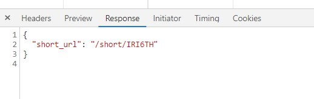

# 短链接服务开发文档

## 1.项目名称:

短链接服务 short_url_service

## 2.项目描述:

使用 python 设计一个 http(s) 短链接服务。访问生成后的短链接可跳转至源链接

要求使用 Flask web 框架，Python3，MySQL，Pipenv（管理python依赖，提供虚拟环境）。具体需求如下：

1. 提供基础的短链接服务（短链接生成、短链接访问）

2. url path 尽可能短小

3. 提供一个可以生成短链接的网页

4. 提供一个可以生成短链接的 RESTful API

5. 提供文档，描述接口格式、代码架构以及设计思路

6. 至少支持 10 亿个短网址

## 3.软件环境以及架构介绍：

1）操作系统：Windows

2）Python版本：Python3.7

3）数据库：MySQL

4）开发工具：PyCharm

5）Python Web框架: Flask

6)  依赖包

```python
Flask==1.1.1
Flask-RESTful==0.3.8
Jinja2==2.11.1
mysqlclient==.4.6
PyMySQL==0.9.3
SQLAlchemy==1.3.15
```


## 4.数据库设计MySQL

```sql
create database short_url_service charset utf8;
use short_url_service;
create table url_info (
    url_id int primary key auto_increment,
    long_url varchar(255) not null,
    short_url varchar(255) not null
) charset utf8;
```

## 5.功能描述:

### 5.1主页

**后端接口:** http://127.0.0.1:10011/api/v1/index

**请求方式:**GET


### 5.2生成短链接

**事件触发:**

用户输入长链接后点击缩短网址按钮。

**后端接口:**http://127.0.0.1:10011/api/v1/change

**请求方式:**POST


**需求参数:**

|   参数   | 数据类型 |       说明       |                      示例                       |
| :------: | :------: | :--------------: | :---------------------------------------------: |
| long_url | varchar  | 用户输入的长链接 | https://github.com/2951121599/short_url_service |

**返回数据:**

- 数据类型:  JSON
- 数据串示例:

```json
{
  "short_url": "/short/IRI6TH"
}    
```

- 参数说明:

|   参数    | 数据类型 |  说明  |
| :-------: | :------: | :----: |
| short_url | varchar  | 短链接 |




### 5.3短链接跳转原网址

- **事件触发:**

  用户在浏览器地址栏输入短链接地址,回车跳转

  **后端接口:**http://127.0.0.1:10011/api/v1/short/<short_url>

  **请求方式:**GET

  

  **需求参数:**

  |   参数    | 数据类型 |  说明  |  示例  |
  | :-------: | :------: | :----: | :----: |
  | short_url | varchar  | 短链接 | IRI6TH |

